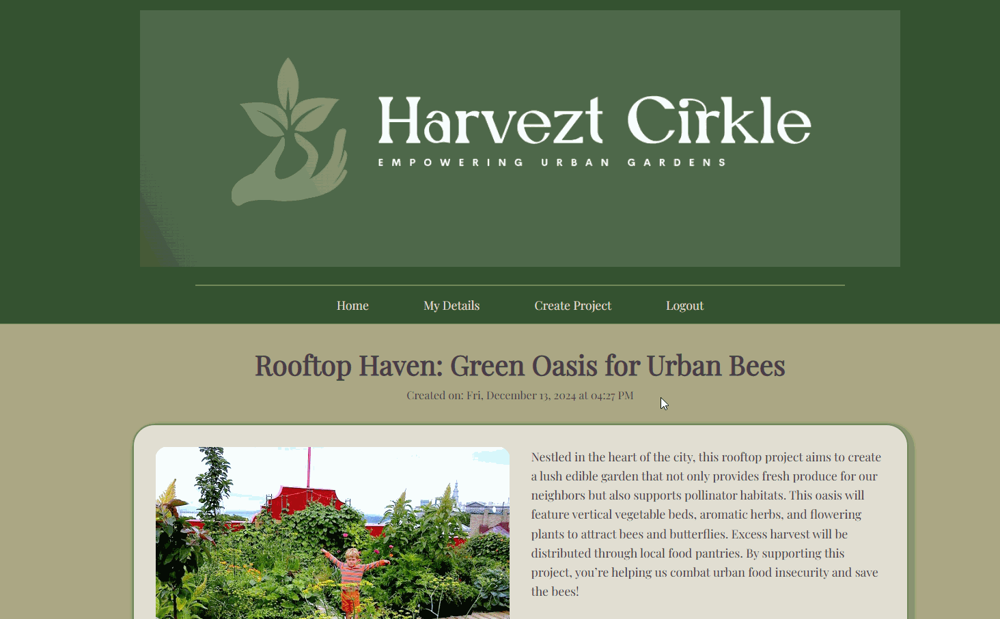

# Crowdfunding Front End for HarveztCirkle

by Anaya Dodge

Deployed front end project link: <https://harveztcirkle.netlify.app/>

> If you want to clone this repo, you must first ensure you have installed the necessary packages and turn on Vite using the following commands in the terminal:
>
> - cd to the file location e.g. cd SheCodes/react/crowdfunding-frontend
> - npm install (if needed)
> - npm run dev

## Project Requirements/Specs

- [x] Be separated in to two distinct projects: an API built using the Django Rest Framework and a website built using React.
- [x] Have a unique and creative project name (bonus points for puns and missing vowels!).
- [x] Define a clear target audience for the platform.
- [x] Implement user accounts with the following attributes:
    - [x] Username
    - [x] Email address
    - [x] Password
- [x] Enable users to create a "project" to be crowdfunded with at least these attributes:
    - [x] Title
    - [x] Owner (a user)
    - [x] Description
    - [x] Image
    - [x] Target amount to fundraise
    - [x] Status of accepting new supporters (open/closed)
    - [x] Creation date
- [x] Allow users to make "pledges" to a project, including at least these attributes:
    - [x] Amount
    - [x] The project the pledge is for
    - [x] The supporter/user (who created the pledge)
    - [x] Option for anonymous pledging
    - [x] Comment on the pledge
- [x] Implement suitable update/delete functionality, e.g., define if a project owner can update project details.
- [x] Define permissions, e.g., specify who can delete a pledge.
- [x] Return relevant status codes for both successful and unsuccessful API requests.
- [x] Handle failed requests gracefully (e.g., implement a custom 404 page instead of a default ev rror page).
- [x] Use Token Authentication, including an endpoint for obtaining a token along with the current user's details.
- [x] Ensure responsive design for mobile and desktop compatibility.

### Deployed Project Link

<https://harveztcirkle.netlify.app/>

### Homepage

### Project Creation page/form

### Project Page

### Making a Pledge against a Project

### Unauthorised user attemps to edit a project

Note: The option to edit or delete a project or pledge is only available to the owner or Admin.

*Bonus Content*

### Sign Up Page

### Login and Log out

### My Details Page - Viewing all Projects and Pledges

### Edit my details

### Update and Delete a Project as Admin
Note: The Admin can update and delete any project or pledge.

### Update and Delete a Project as Owner
Note: The Owner can edit their Project or Pledge.  They can make a request to the Admin to delete their Project or Pledge.

